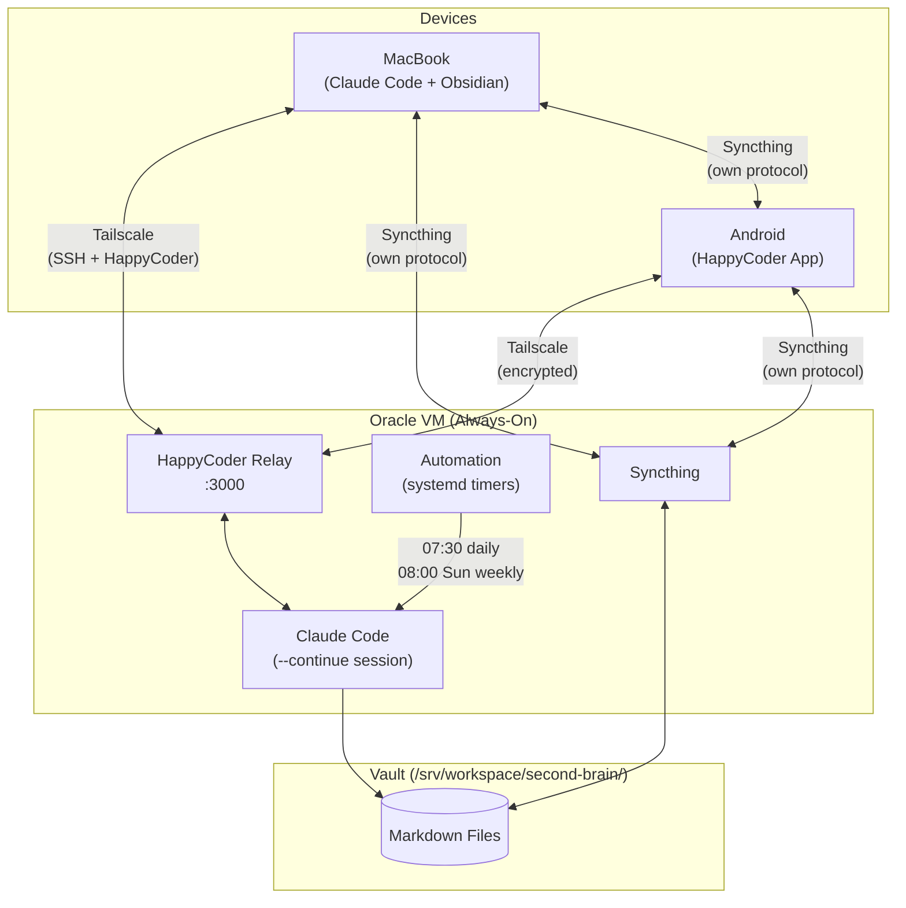
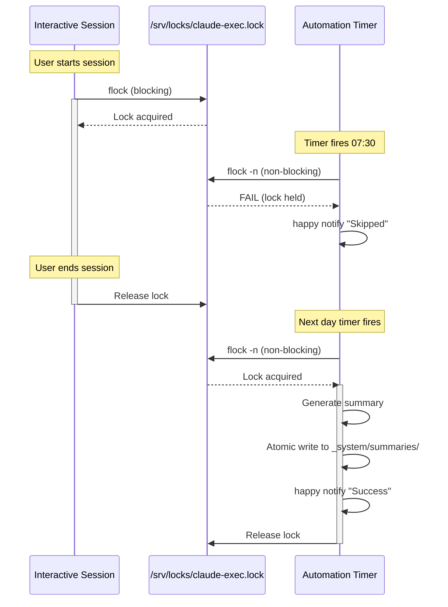
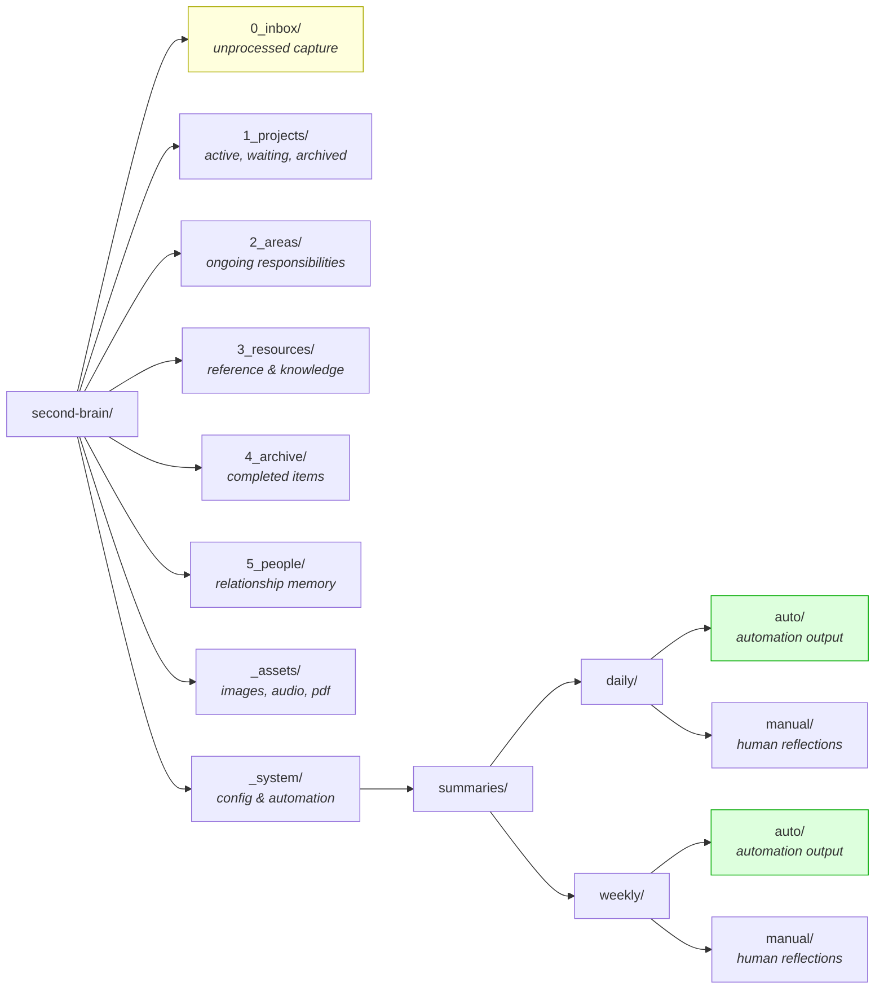
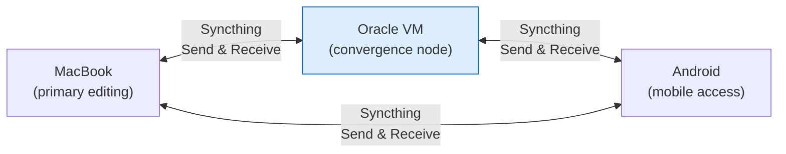

# Second Brain — System Architecture

## Device Topology

## Data Flow

## Concurrency & Locking

## Directory Structure

## Sync Topology

All peers are equal — no single source of truth. The VM acts as an always-on convergence point but is not authoritative.
