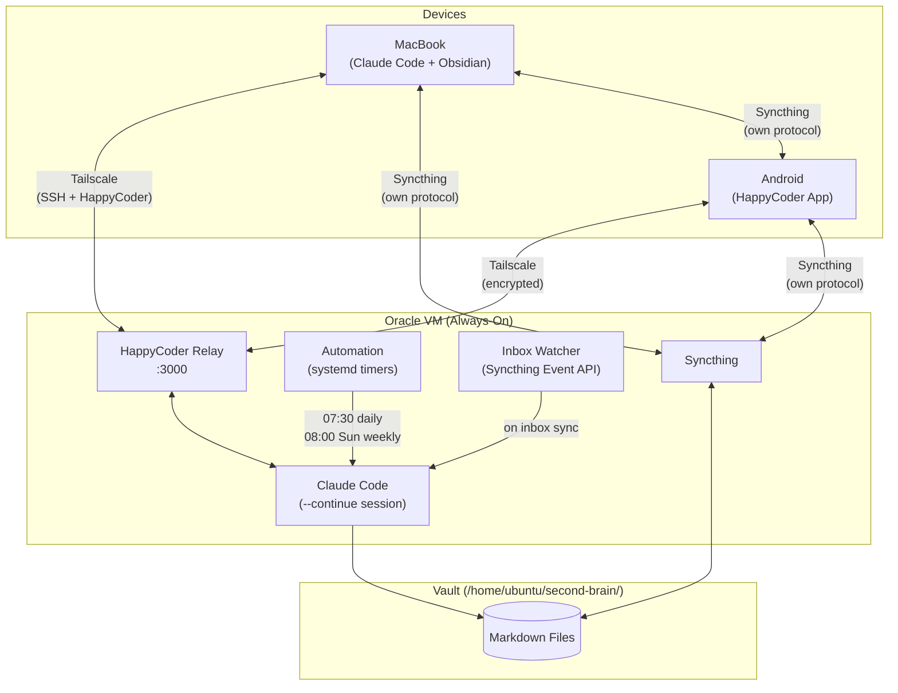
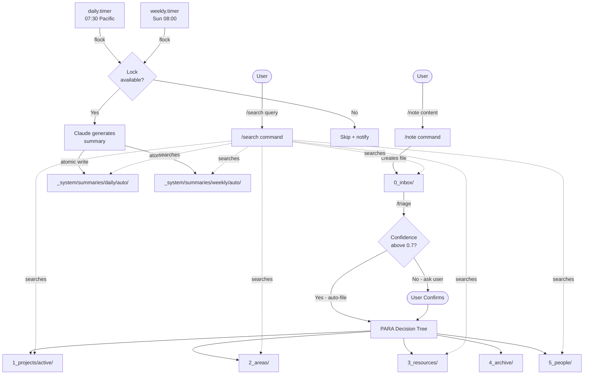
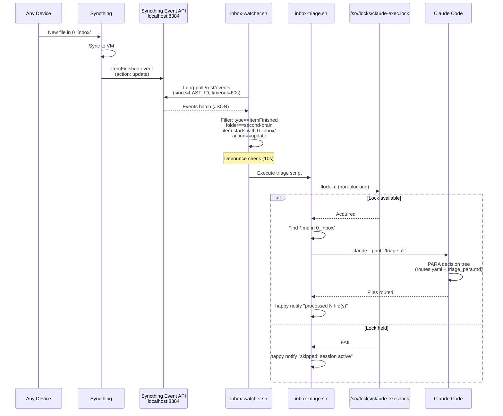
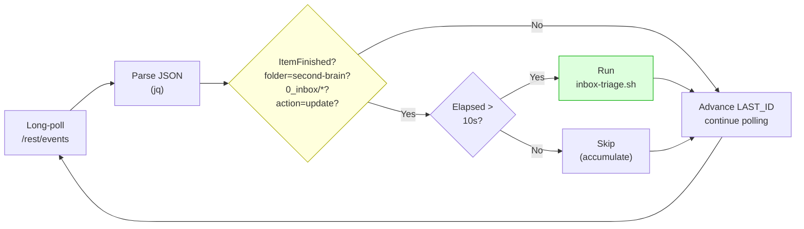
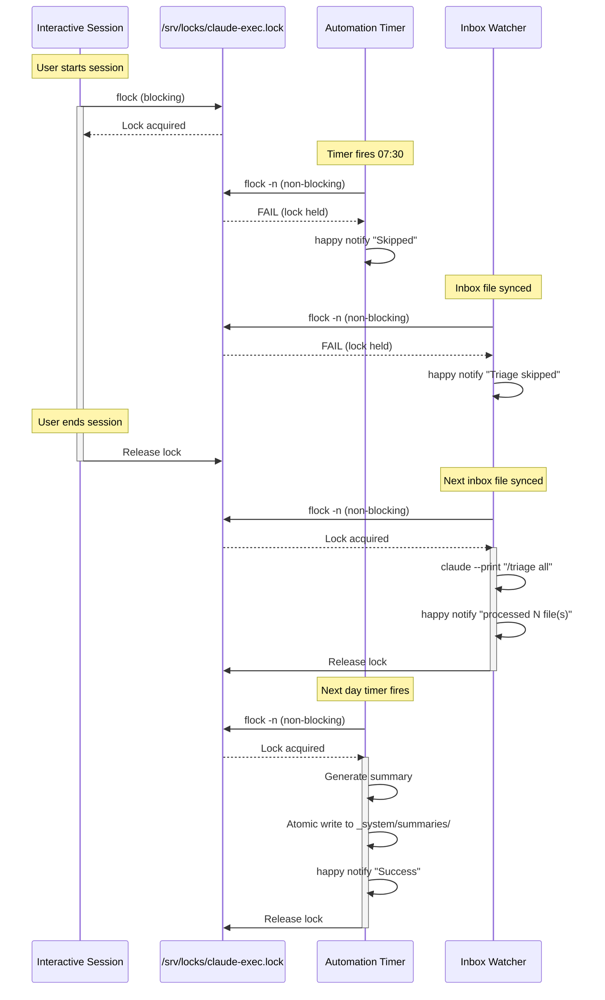
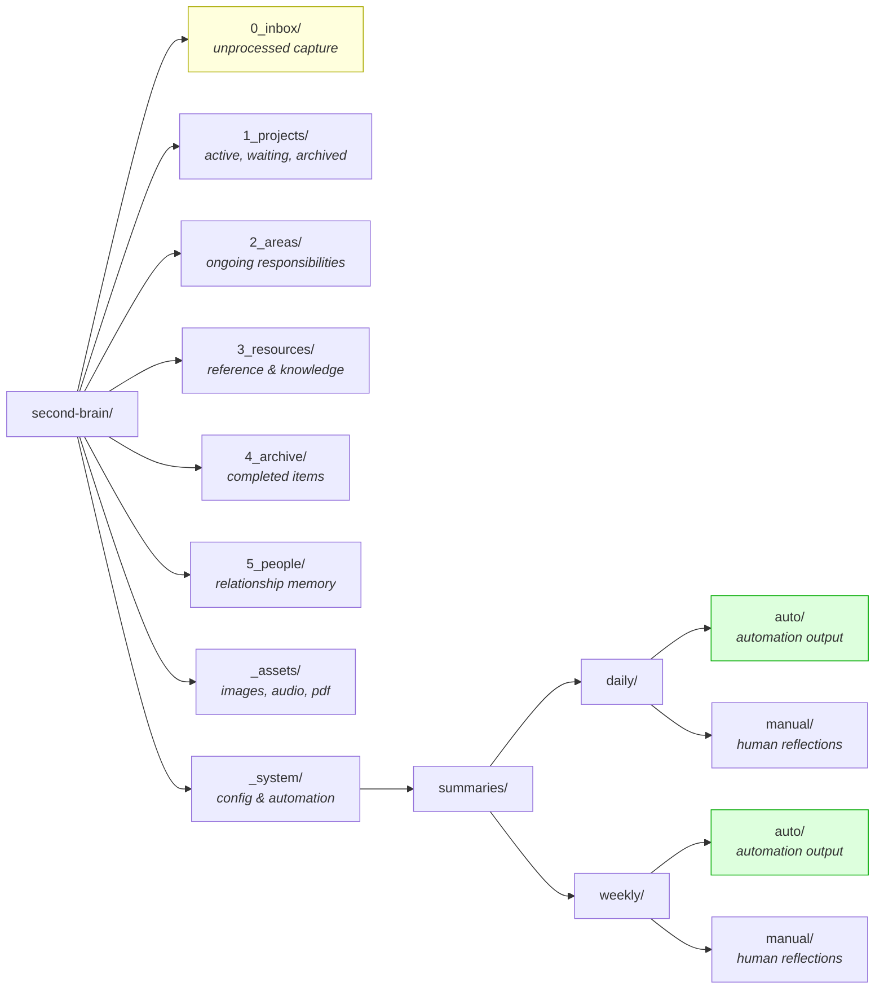
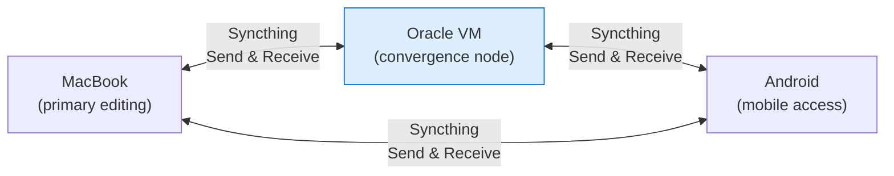

# Second Brain — System Architecture

## Device Topology



## Data Flow



## Inbox Watcher — Sync-Triggered Triage

The inbox watcher automatically triages new files dropped into `0_inbox/` from any device. Rather than polling the filesystem, it uses the Syncthing Event API to detect exactly when a file finishes syncing.

### Sync Flow



### Event Processing Pipeline



### Configuration

| Variable | Default | Source |
|----------|---------|--------|
| `VAULT_DIR` | `/home/ubuntu/second-brain` | systemd Environment |
| `LOCK_FILE` | `/srv/locks/claude-exec.lock` | systemd Environment |
| `SYNCTHING_API` | `http://localhost:8384` | script default |
| `SYNCTHING_FOLDER` | `second-brain` | script default |
| `DEBOUNCE_SECONDS` | `10` | script default |
| `TRIAGE_SCRIPT` | `/srv/scripts/inbox-triage.sh` | systemd Environment |
| `SYNCTHING_API_KEY` | auto-resolved from config.xml | script resolution |

API key resolution searches (in order):
1. `$HOME/.local/state/syncthing/config.xml`
2. `$HOME/.config/syncthing/config.xml`
3. `/etc/syncthing/config.xml`

## Concurrency & Locking



All three consumers — interactive sessions, scheduled timers, and the inbox watcher — share the same lock file. Only one Claude Code process runs at a time. Interactive sessions always win (blocking lock); automation and watcher skip gracefully (non-blocking).

## Directory Structure



## Sync Topology



All peers are equal — no single source of truth. The VM acts as an always-on convergence point but is not authoritative.

## Systemd Services

| Unit | Type | Schedule | Purpose |
|------|------|----------|---------|
| `happy-interactive.service` | forking | always-on | tmux session for interactive Claude Code |
| `happy-automation-daily.timer` | oneshot | 07:30 daily | daily vault summary |
| `happy-automation-weekly.timer` | oneshot | Sun 08:00 | weekly vault summary |
| `happy-inbox-watcher.service` | simple | always-on | Syncthing event poller for auto-triage |

All services use `{{VAULT_DIR}}` template placeholders, stamped by `install.sh` via `sed` at deploy time.

## Reliability & SLA

### Inbox Watcher

| Metric | Target | Mechanism |
|--------|--------|-----------|
| Detection latency | < 75s from sync completion | 60s long-poll timeout + jq processing |
| Restart on crash | Automatic, 15s delay | `Restart=always`, `RestartSec=15` |
| Event continuity | No missed events | `since=LAST_ID` tracks position in event stream |
| Startup behavior | Ignores history | Fetches latest event ID on start, only processes new events |
| Debounce | 10s between triggers | Prevents rapid-fire triage on bulk syncs |
| Concurrent safety | Single Claude process | flock on `/srv/locks/claude-exec.lock` |
| Graceful degradation | Skip on lock contention | Non-blocking flock; notifies and exits cleanly |
| API failure recovery | Retry after 10s | curl failure triggers sleep + continue |

### Scheduled Summaries

| Metric | Target | Mechanism |
|--------|--------|-----------|
| Daily summary | 07:30 Pacific | systemd `OnCalendar`, `Persistent=true` |
| Weekly summary | Sunday 08:00 Pacific | systemd `OnCalendar`, `Persistent=true` |
| Missed timer catchup | Run on next boot | `Persistent=true` fires missed timers |
| Idempotency | One summary per day/week | Checks if output file already exists |
| Atomic writes | No partial files | Write to `.tmp`, then `mv` to final path |
| Failure notification | Always | `trap cleanup_on_error ERR` + `happy notify` |

### Known Limitations

- **Syncthing Event API subscriptions**: The `events=` URL filter uses per-subscription IDs that drift from the global stream. The watcher fetches all events and filters client-side with `jq` to avoid this.
- **No persistent cursor**: If the watcher restarts, it starts from the latest event ID. Events that occurred between crash and restart are not replayed. Files already synced will be triaged on the next sync event or manual `/triage` run.
- **Claude Code availability**: Triage depends on Claude Code being installed and authenticated on the VM. If the API key expires or Claude is unavailable, `inbox-triage.sh` will fail and notify.

## Logging & Observability

### Log Locations

| Component | Command | Notes |
|-----------|---------|-------|
| Inbox watcher | `journalctl -u happy-inbox-watcher.service` | Long-lived; logs every detected file |
| Inbox triage | `journalctl -u happy-inbox-watcher.service` | Runs as subprocess of watcher |
| Daily summary | `journalctl -u happy-automation-daily.service` | One-shot; check after 07:30 |
| Weekly summary | `journalctl -u happy-automation-weekly.service` | One-shot; check after Sunday 08:00 |
| Interactive session | `journalctl -u happy-interactive.service` | tmux session lifecycle |
| Timer schedules | `systemctl list-timers --all` | Next/last fire times |
| Triage audit log | `_system/processing-log.md` | Append-only log of PARA routing decisions |
| Syncthing | `journalctl -u syncthing@ubuntu.service` | Sync events, conflicts, errors |

### Log Format

The inbox watcher outputs structured log lines:

```
inbox-watcher: started
  vault:    /home/ubuntu/second-brain
  folder:   second-brain
  api:      http://localhost:8384
  debounce: 10s
  starting from event ID: 8280
  synced: 0_inbox/my-new-note.md
  triggering triage for 1 file(s)
inbox-triage: processing 1 file(s)
inbox-triage: complete
```

### Happy Notifications

All automation sends notifications via `happy notify`:

| Event | Message |
|-------|---------|
| Triage success | `Inbox triage: processed N file(s)` |
| Triage skipped (lock) | `Inbox triage skipped: session active` |
| Triage failed | `Inbox triage failed` |
| Daily summary written | `Daily summary written for YYYY-MM-DD` |
| Daily summary skipped | `Skipped: daily summary already exists for YYYY-MM-DD` |
| Daily summary failed | `Failed: daily summary generation error for YYYY-MM-DD` |

## Debug Guide

### Inbox watcher not detecting files

```bash
# 1. Check service is running
systemctl status happy-inbox-watcher.service

# 2. Check recent logs
journalctl -u happy-inbox-watcher.service -n 50 --no-pager

# 3. Verify Syncthing API is reachable
curl -sf -H "X-API-Key: $(grep -oP '(?<=<apikey>).*(?=</apikey>)' \
    ~/.local/state/syncthing/config.xml)" \
    "http://localhost:8384/rest/events?limit=1" | jq .

# 4. Check for recent ItemFinished events
curl -sf -H "X-API-Key: YOUR_KEY" \
    "http://localhost:8384/rest/events?limit=20&timeout=1" | \
    jq '.[] | select(.type=="ItemFinished") | {id, item: .data.item, action: .data.action}'

# 5. Verify Syncthing folder ID matches
curl -sf -H "X-API-Key: YOUR_KEY" \
    "http://localhost:8384/rest/config/folders" | jq '.[].id'
```

### Triage not running after detection

```bash
# 1. Check lock contention — who holds it?
fuser /srv/locks/claude-exec.lock

# 2. Verify triage script is executable
ls -la /srv/scripts/inbox-triage.sh

# 3. Check lock directory permissions
ls -la /srv/locks/

# 4. Manually test triage
/srv/scripts/inbox-triage.sh

# 5. Verify Claude Code is available
which claude && claude --version
```

### Service keeps restarting

```bash
# 1. Check exit code and error
systemctl status happy-inbox-watcher.service
journalctl -u happy-inbox-watcher.service -n 20 --no-pager

# 2. Common causes:
#    - HOME unbound: check Environment=HOME in service unit
#    - API key not found: set SYNCTHING_API_KEY or check config.xml path
#    - curl/jq not installed: which curl jq
#    - Syncthing not running: systemctl status syncthing@ubuntu.service

# 3. Test script manually as ubuntu user
sudo -u ubuntu /srv/scripts/inbox-watcher.sh
```

### Verifying end-to-end flow

```bash
# 1. Create test file on any device
echo "# Test" > /path/to/second-brain/0_inbox/test-triage.md

# 2. Watch watcher logs in real-time
journalctl -u happy-inbox-watcher.service -f

# 3. Expected output (within ~60s of sync):
#    synced: 0_inbox/test-triage.md
#    triggering triage for 1 file(s)
#    inbox-triage: processing 1 file(s)
#    inbox-triage: complete

# 4. Verify file was routed
ls 0_inbox/test-triage.md  # should be gone
# Check 1_projects/, 2_areas/, 3_resources/, etc. for routed file

# 5. Clean up if still in inbox
rm 0_inbox/test-triage.md
```

### Redeploying after changes

```bash
# From the repo directory on the VM:
sudo bash install.sh

# Or to redeploy just the watcher:
sudo cp scripts/inbox-watcher.sh /srv/scripts/
sudo cp scripts/inbox-triage.sh /srv/scripts/
sudo chmod +x /srv/scripts/inbox-*.sh
sudo sed 's|{{VAULT_DIR}}|/home/ubuntu/second-brain|g' \
    systemd/happy-inbox-watcher.service > /tmp/watcher.service
sudo mv /tmp/watcher.service /etc/systemd/system/happy-inbox-watcher.service
sudo systemctl daemon-reload
sudo systemctl restart happy-inbox-watcher.service
```
